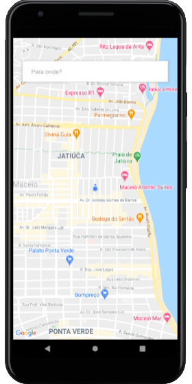
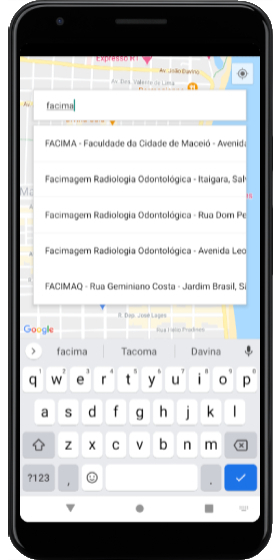

# Clone Uber

## Inspired by the project with updated libs: https://github.com/rocketseat-content/youtube-react-native-uber

## Technologies

- React Native (https://facebook.github.io/react-native)
- React Navigation (https://reactnavigation.org)

## Google Maps APIs

- Maps SDK for Android
- Geocoding API
- Geolocation API
- Places API

## Images

## Download APK (https://i.diawi.com/1zhp6V)
